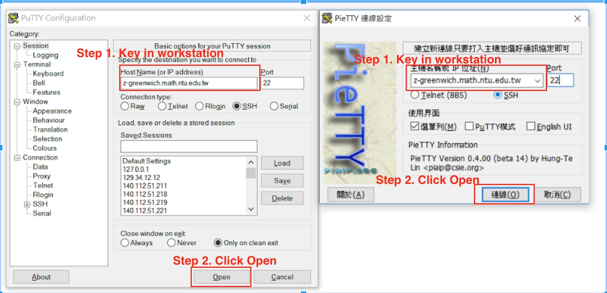
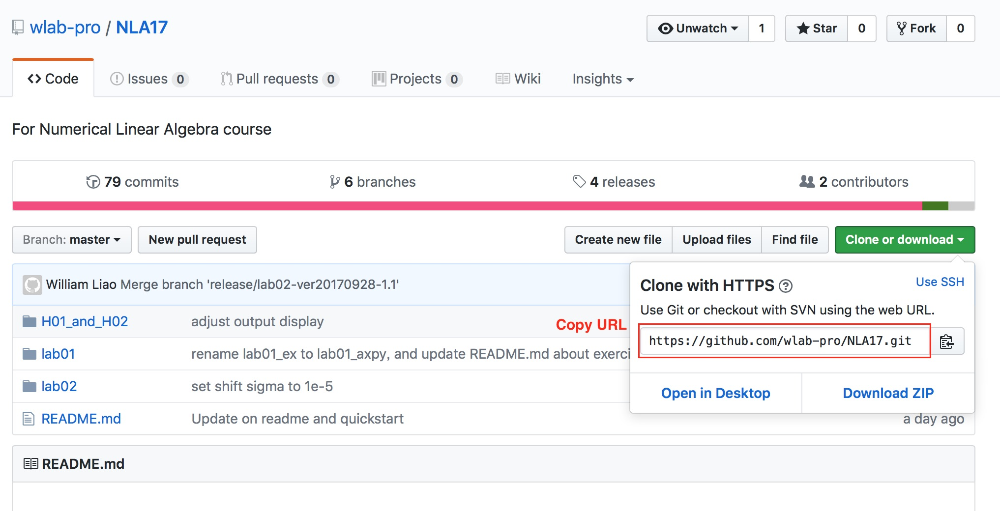
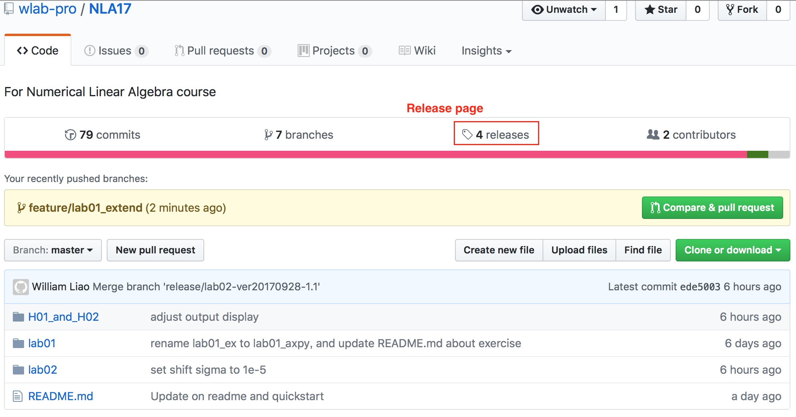
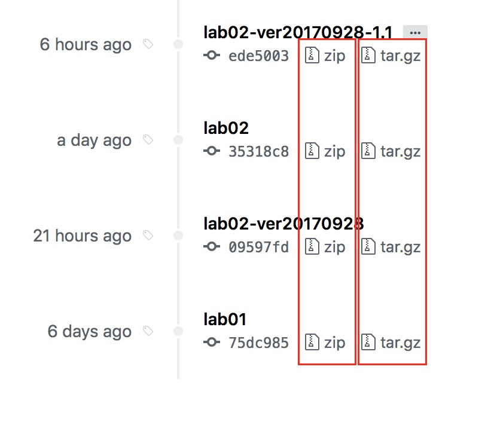
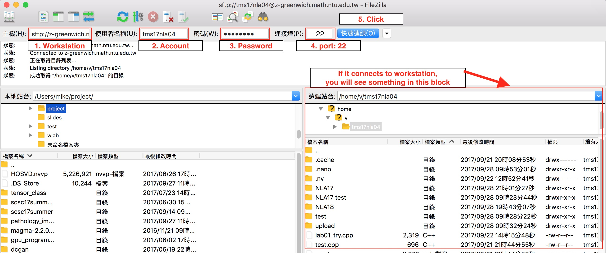
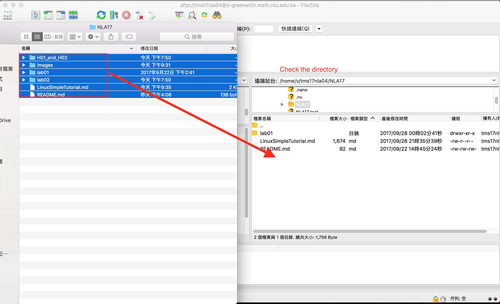
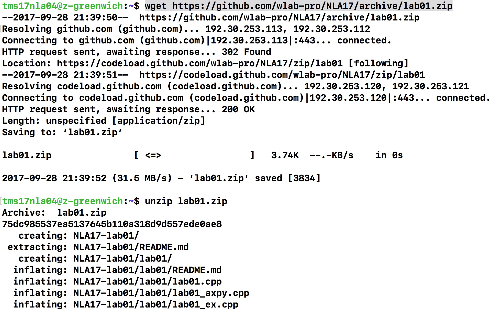
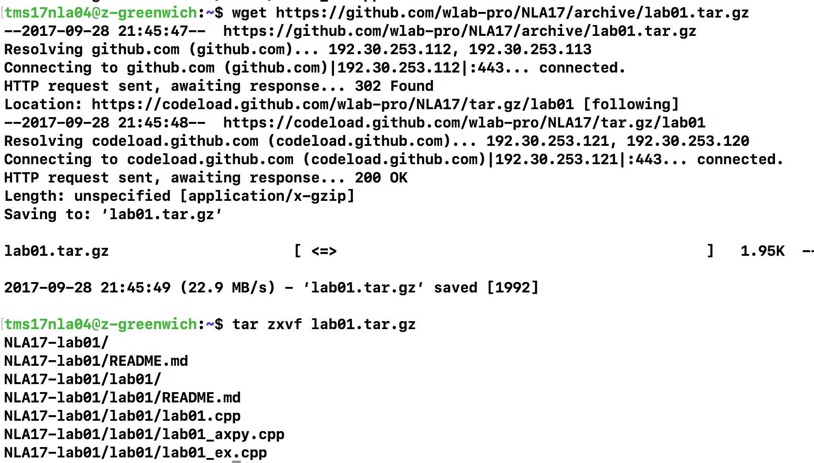
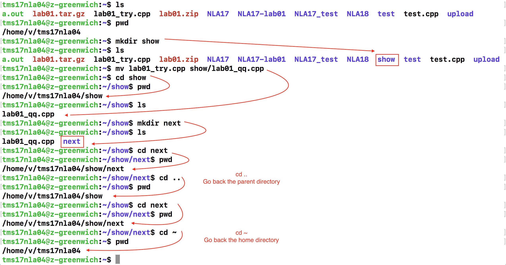

# Linux Simple Tutorial
This is a simple tutorial for linux beginner.
* [Login workstation](#login-workstation)
* [Get this repository](#get-this-repository)
* [Linux commands](#linux-commands)
* [Local Editor](#local-editor)
# Login workstation
## Windows User
Please download putty or pietty  

After enter the workstation, key in account and password.
## Mac User
Open your Terminal (終端機), and key in the command
```
ssh [account]@[workstation]
```
For example,
```
ssh tms17nla04@z-greenwich.math.ntu.edu.tw
```
If you see the following the information, key 'yes'
```
The authenticity of host 'workstation' can't be established.
ECDSA key fingerprint is SHA256:**********.
Are you sure you want to continue connecting (yes/no)?
yes
```

# Get this repository
## git clone
Use __git__ to download the repository  
Copy the URL in the GitHub

```
git clone https://github.com/wlab-pro/NLA17.git
```
If you want to clone into different directory, you can use this command
```
git clone https://github.com/wlab-pro/NLA17.git [folder name]
```
For example,
```
git clone https://github.com/wlab-pro/NLA17.git NLA17_test
```
__Note__:  
If the folder already exists, git clone will fail.  
Please delete the folder or clone into another folder.
## wget or Filezilla
In the release page, we can download the previous released file.

You can select *.zip or *.tar.gz

### FileZilla
Go to [FileZilla](https://filezilla-project.org) website to download the FileZilla Client
1. Connect to the workstation

2. Upload the file
Drag files to the right window for uploading files.

### wget
Copy the download link in the release page.
Download it by this command
```
wget [download-url]
```
For example,
```
wget https://github.com/wlab-pro/NLA17/archive/lab01.zip
```
For *.zip, use unzip to decompress it
```
unzip [*.zip]
```

For *.tar.gz, use tar zxvf to decompress it
```
tar zxvf [*.tar.gz]
```


# Linux commands
## File managing
We usually use 'pwd', 'cd', 'ls', 'mkdir', 'mv'
- pwd
It tells us the path where we are now.
```
pwd
```
- cd
```
cd [folder-path]
```
- ls
List the files and directories.
```
ls
```
- mkdir
Make a new directory
```
mkdir [folder-name]
```
- mv
Move file or directory
```
mv [source] [destination]
```

Please see websites 
[鳥哥的私房菜 Linux 檔案與目錄管理](http://linux.vbird.org/linux_basic/0220filemanager.php)
or [wikibook](https://en.wikibooks.org/wiki/Guide_to_Unix/Commands/File_System_Utilities)
## Workstaion Editor
Use 'vi', 'vim' or 'nano' on the workstation  
For nano, its command is at the bottom of window.  
Note. ^ means Control button, so '^X' means 'Control + X'.  
For vi, Please see websites [鳥哥的私房菜 vim 程式編輯器](http://linux.vbird.org/linux_basic/0310vi.php)

# Local Editor
I recommand 'Sublime Text' and 'Visual Studio Code'.  
They allow us to edit file in our workstation. Upload files to the workstation automatically when we save files.  
For Sublime Text, install 'Package Control' and then install 'SFTP'.  
For Visual Studio Code, install 'ftp-sync'.