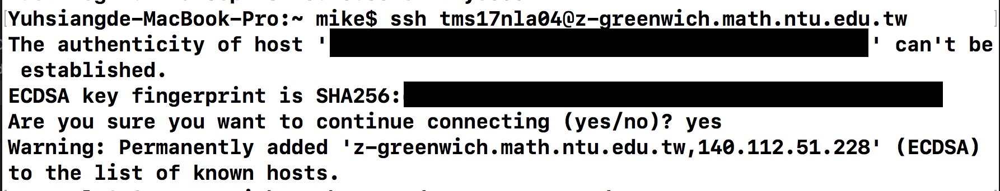

# Linux Simple Tutorial
This is a simple tutorial for linux beginner.

# Login workstation
## Windows User
Please download putty or pietty  

After enter the workstation, key in account and password.
## Mac User
Open your Terminal (終端機), and key in the command
```
ssh [account]@[workstation]
```
For example,
```
ssh tms17nla04@z-greenwich.math.ntu.edu.tw
```
If you see the following the information, key 'yes'
```
The authenticity of host 'workstation' can't be established.
ECDSA key fingerprint is SHA256:**********.
Are you sure you want to continue connecting (yes/no)?
yes
```

# Get this repository
## git clone
Use __git__ to download the repository  
Copy the URL in the GitHub

```
git clone https://github.com/wlab-pro/NLA17.git
```
If you want to clone into different directory, you can use this command
```
git clone https://github.com/wlab-pro/NLA17.git [folder name]
```
For example,
```
git clone https://github.com/wlab-pro/NLA17.git NLA17_test
```
## wget or Fillzilla
