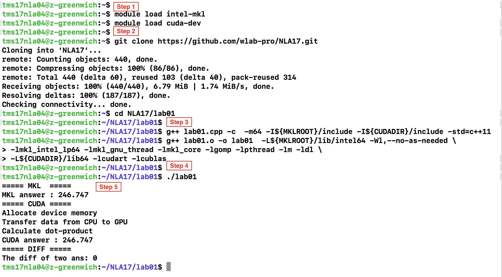

# NLA17 - lab01
This is lab01 of NLA17.  
You will develop a program which computes the dot product of two vectors.  

# Library
- INTEL-MKL
- CUDA

# Information
If you are not familiar with Linux, you can see this document [__LinuxSimpleTutorial__](../LinuxSimpleTutorial.md)

# For this course
If you use the work-station which we provide in this course, you can do 
the following steps to complete lab01.  
If you have the CUDA coding experience, you can try to finish lab01_ex.cpp first.
## Step 1: Module system
We build up a module system for using library easily.
To load the modules, simply type:
```
module load intel-mkl
module load cuda-dev
```
You can use __MKL__ and __CUDA__ libraries now.
## Step 2: Get the repository
More detail of each comment is in [__LinuxSimpleTutorial__](../LinuxSimpleTutorial.md)
```
git clone https://github.com/wlab-pro/NLA17.git
cd NLA17/lab01
```
__Note__ : The following commands are run in __lab01__ directory
## Step 3: Code compilation
```
g++ lab01.cpp -c  -m64 -I${MKLROOT}/include -I${CUDADIR}/include -std=c++11
g++ lab01.o -o lab01  -L${MKLROOT}/lib/intel64 -Wl,--no-as-needed \
-lmkl_intel_lp64 -lmkl_gnu_thread -lmkl_core -lgomp -lpthread -lm -ldl \
-L${CUDADIR}/lib64 -lcudart -lcublas
```
## Step 4: Code execution
```
./lab01
```
## Step 5: Results
You will see similar output like
```
===== MKL  =====
MKL answer : 246.747 
===== CUDA =====
Allocate device memory
Transfer data from CPU to GPU
Calculate dot-product
CUDA answer : 246.747
===== DIFF =====
The diff of two ans: 0
```
## Sreenshot

## Exercise
Some hints in the *.cpp
1. Please complete lab01_ex.cpp.
2. Try to complete lab01_axpy.cpp. (*axpy* : a * x + y).

### How to compile those code
```
g++ [filename.cpp] -c  -m64 -I${MKLROOT}/include -I${CUDADIR}/include -std=c++11
g++ [filename.o] -o [filename]  -L${MKLROOT}/lib/intel64 -Wl,--no-as-needed \
-lmkl_intel_lp64 -lmkl_gnu_thread -lmkl_core -lgomp -lpthread -lm -ldl \
-L${CUDADIR}/lib64 -lcudart -lcublas
```
For example,
```
g++ lab01_axpy.cpp -c  -m64 -I${MKLROOT}/include -I${CUDADIR}/include -std=c++11
g++ lab01_axpy.o -o lab01_axpy -L${MKLROOT}/lib/intel64 -Wl,--no-as-needed \
-lmkl_intel_lp64 -lmkl_gnu_thread -lmkl_core -lgomp -lpthread -lm -ldl \
-L${CUDADIR}/lib64 -lcudart -lcublas
```
### How to Run those code
In your excutation program directory
```
./[filename]
```
For example,
```
./lab01_axpy
```